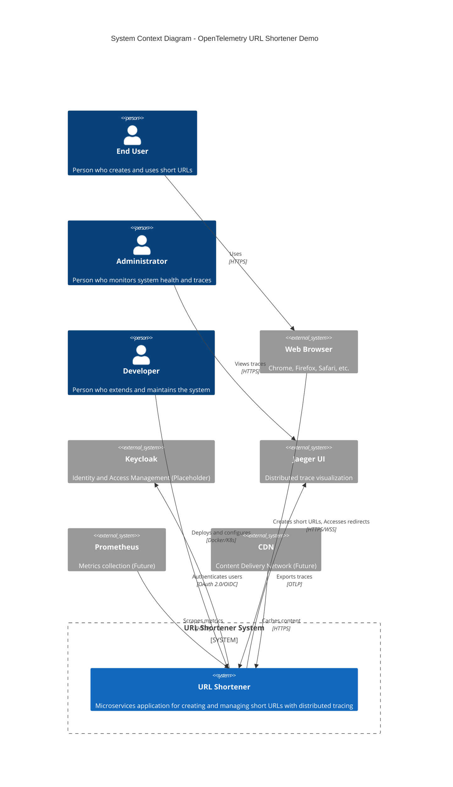
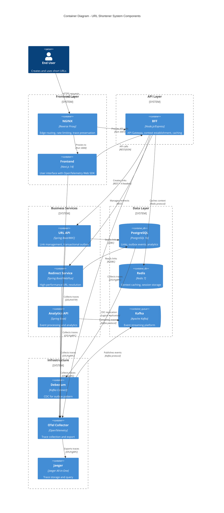
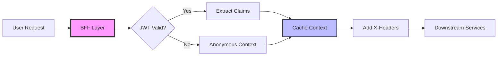
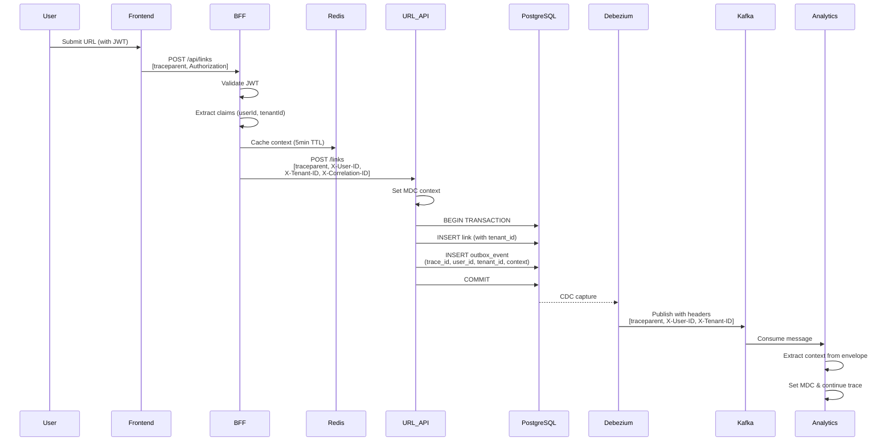
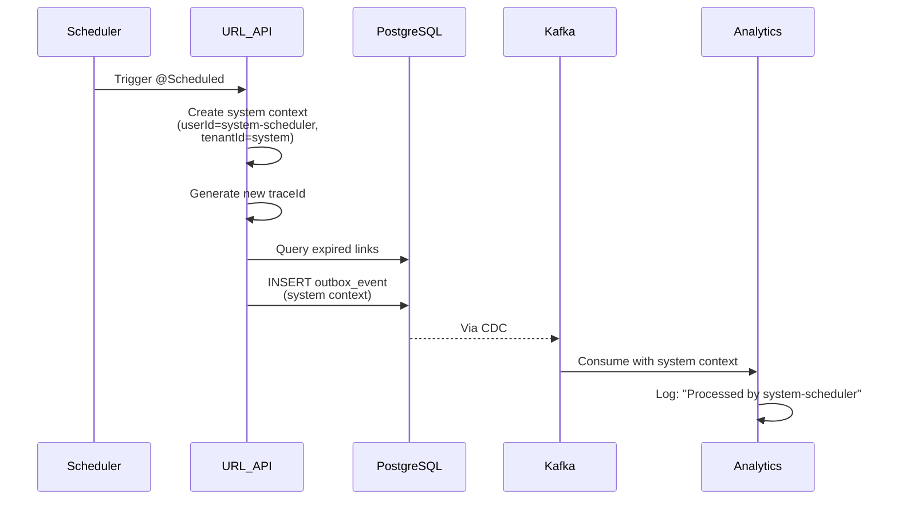

# Architecture Documentation

## Table of Contents
1. [System Overview](#system-overview)
2. [C4 Context Diagram](#c4-context-diagram)
3. [Service Architecture](#service-architecture)
4. [Trace Propagation Design](#trace-propagation-design)
5. [Data Flow Patterns](#data-flow-patterns)
6. [Technology Decisions](#technology-decisions)
7. [Security & Authentication](#security--authentication)
8. [Scalability Considerations](#scalability-considerations)

## System Overview

The OpenTelemetry URL Shortener Demo is a microservices-based application designed to demonstrate distributed tracing across various architectural patterns and boundaries.

### Core Design Principles

1. **Trace-First Architecture**: Every component is designed with observability as a primary concern
2. **Polyglot Services**: Mix of Node.js and Java to demonstrate cross-language trace propagation
3. **Mixed Paradigms**: Both synchronous (REST) and asynchronous (CDC/Kafka) communication
4. **Production Patterns**: Implements real-world patterns like transactional outbox and edge caching

## C4 Context Diagram

The following C4 Context diagram illustrates the URL Shortener system and its interactions with external actors and systems:



### System Components Overview

The URL Shortener System consists of multiple internal components working together:



### Key Architectural Characteristics

| Characteristic | Implementation |
|---------------|----------------|
| **Distributed Tracing** | W3C Trace Context propagation across all services |
| **Polyglot Architecture** | Node.js (BFF), Java (Services), PostgreSQL, Redis |
| **Communication Patterns** | Synchronous (REST) and Asynchronous (Kafka/CDC) |
| **Resilience Patterns** | Transactional outbox, circuit breakers (planned) |
| **Caching Strategy** | Redis for context caching with TTL |
| **Security Model** | OAuth 2.0/OIDC (placeholder), service mesh ready |
| **Observability** | OpenTelemetry traces, structured logging with MDC |
| **Scalability** | Stateless services, horizontal scaling ready |

## Service Architecture

### Layer 1: Edge Services

#### NGINX (Port 80)
- **Purpose**: Edge routing, rate limiting, SSL termination
- **Trace Features**: Preserves W3C trace context headers
- **Configuration**: Custom nginx.conf with trace header preservation

#### Frontend (Port 3000)
- **Technology**: Next.js 14 with App Router
- **Trace Initiation**: Generates initial trace with OpenTelemetry Web SDK
- **Key Files**: 
  - `instrumentation.ts`: OpenTelemetry setup
  - `app/page.tsx`: Main UI component

### Layer 2: API Gateway

#### BFF - Backend for Frontend (Port 3001)
- **Technology**: Node.js with Express
- **Responsibilities**:
  - Authentication orchestration (placeholder)
  - Context establishment
  - Request routing
  - Redis caching
- **Trace Features**:
  - Establishes MDC-like context
  - Propagates business headers (X-User-ID, X-Tenant-ID)
  - Simplified middleware spans for demo clarity
- **Key Components**:
  - `middleware/context.js`: Context establishment
  - `redis-client.js`: Caching layer
  - `otel-instrumentation.js`: Trace configuration

### Layer 3: Business Services

#### URL API (Port 8080)
- **Technology**: Spring Boot 3.5.3 with Spring MVC (Servlet-based)
- **Database**: PostgreSQL via JDBC/HikariCP
- **Responsibilities**:
  - Link creation and management
  - Transactional outbox pattern
  - Scheduled jobs (expiration, analytics)
- **Trace Features**:
  - Auto-instrumentation via Spring Boot starter
  - MDC integration for structured logging
  - Trace context saved to outbox for async propagation
- **Key Components**:
  - `ScheduledJobs.java`: Background tasks with tracing
  - `MdcContextFilter.java`: MDC population from headers
  - Outbox integration for CDC

#### Redirect Service (Port 8081)
- **Technology**: Spring Boot 3.5.3 with Spring WebFlux (Reactive)
- **Database**: PostgreSQL via R2DBC (non-blocking)
- **Responsibilities**:
  - High-performance URL resolution
  - Redirect handling
- **Trace Features**:
  - Reactive trace propagation
  - WebFilter-based MDC context
- **Note**: Kafka publishing for clicks is TODO

#### Analytics API (Port 8082)
- **Technology**: Spring Boot 3.5.3
- **Responsibilities**:
  - Kafka event consumption
  - Analytics processing
- **Trace Features**:
  - Extracts trace context from Kafka headers
  - Continues traces from CDC events
  - Marks async boundaries

### Layer 4: Infrastructure Services

#### PostgreSQL (Port 5432)
- **Version**: 16-alpine
- **Features**:
  - Logical replication enabled for CDC
  - Outbox table with trace context columns
- **Tables**:
  - `links`: URL mappings
  - `outbox_events`: Transactional outbox with trace context
  - `clicks`: Click analytics (placeholder)

#### Kafka (Port 9092)
- **Version**: Confluent 7.3.0
- **Topics**:
  - `link-events`: Link creation events from CDC
  - `analytics-events`: Scheduled analytics reports
  - `url-clicks`: Click events (planned)

#### Debezium/Kafka Connect (Port 8083)
- **Version**: 2.5
- **Configuration**:
  - PostgreSQL source connector
  - Outbox Event Router SMT
  - Trace context header mapping

#### Redis (Port 6379)
- **Version**: 7-alpine
- **Usage**:
  - Context caching with TTL
  - Session storage (placeholder)

#### OpenTelemetry Collector (Port 4317/4318)
- **Receivers**: OTLP (gRPC and HTTP)
- **Exporters**: Jaeger
- **Features**: Batch processing, retry logic

#### Jaeger (Port 16686)
- **Purpose**: Trace storage and visualization
- **UI Features**: Service dependency graph, trace timeline

## Context Propagation Design

The system implements two complementary context propagation mechanisms:
1. **Trace Context**: Technical correlation using W3C standards
2. **Standard Context**: Business correlation using custom headers

### Trace Context Propagation (W3C)

#### Synchronous Propagation (HTTP)

```
Frontend → BFF → URL API
    ↓       ↓       ↓
[traceparent header propagation]
```

1. Frontend generates initial trace
2. Each service extracts and continues trace
3. Auto-instrumentation handles span creation

#### Asynchronous Propagation (CDC/Kafka)

```
URL API → Outbox Table → Debezium → Kafka → Analytics API
    ↓          ↓            ↓         ↓           ↓
[trace_id, parent_span_id saved and propagated as headers]
```

1. URL API saves trace context to outbox
2. Debezium captures and maps to Kafka headers
3. Analytics API reconstructs traceparent
4. Trace continues with async boundary marker

### Standard Context Propagation

#### Context Establishment Flow



#### Context Components

| Component | Location | Purpose |
|-----------|----------|---------|
| **JWT Claims Extraction** | BFF | Extract user identity from token |
| **Context Cache** | Redis | Store validated context (5min TTL) |
| **MDC Filter** | Java Services | Extract headers to logging context |
| **Context Holder** | Service Layer | Thread-local context storage |
| **Outbox Context** | PostgreSQL | Persist context for async flows |

### Context Headers Reference

| Header | Type | Purpose | Generator |
|--------|------|---------|-----------|
| **Trace Context** | | | |
| `traceparent` | W3C | Distributed trace correlation | OpenTelemetry |
| `tracestate` | W3C | Vendor-specific trace data | OpenTelemetry |
| **Standard Context** | | | |
| `X-User-ID` | Business | User identity | BFF |
| `X-Tenant-ID` | Business | Multi-tenancy isolation | BFF |
| `X-User-Email` | Business | User email | BFF |
| `X-User-Groups` | Business | User group membership | BFF |
| `X-Request-ID` | Business | Unique request identifier | BFF |
| `X-Correlation-ID` | Business | Business correlation | BFF |
| `X-Session-ID` | Business | Session tracking | Frontend |
| `X-Device-ID` | Business | Device identification | Frontend |
| `X-Service-Name` | Business | Origin service | Each service |
| `X-Transaction-Type` | Business | Business operation type | BFF |
| `X-Client-IP` | Business | Client IP address | BFF |

### Context Storage & Persistence

#### Synchronous Context Flow
```
Frontend (sessionStorage) → BFF (Redis) → Services (ThreadLocal/MDC)
```

#### Asynchronous Context Flow
```
Service → Outbox Table (context columns) → Kafka (headers/envelope) → Consumer (MDC)
```

#### Database Schema
```sql
-- Outbox table with both trace and standard context
CREATE TABLE outbox_events (
    -- Business data
    id UUID PRIMARY KEY,
    aggregate_id VARCHAR(255),
    event_type VARCHAR(100),
    payload JSONB,
    
    -- Trace context (W3C)
    trace_id VARCHAR(32),
    parent_span_id VARCHAR(16),
    trace_flags VARCHAR(2),
    
    -- Standard context
    context JSONB,  -- Full context as JSON
    user_id VARCHAR(255),
    tenant_id VARCHAR(255),
    correlation_id VARCHAR(255),
    
    -- Metadata
    created_at TIMESTAMP,
    created_by VARCHAR(255)
);
```

## Data Flow Patterns

### Pattern 1: Link Creation Flow with Full Context



### Pattern 2: Transactional Outbox with Context

The outbox pattern ensures:
1. **Atomicity**: Event and business data in same transaction
2. **Reliability**: No lost events
3. **Context Continuity**: Both trace and business context preserved

```sql
-- Single transaction with full context
BEGIN;
  INSERT INTO links (
    short_code, long_url, tenant_id, created_by
  ) VALUES (
    'abc123', 'https://example.com', 'tenant-456', 'user-123'
  );
  
  INSERT INTO outbox_events (
    aggregate_id, event_type, payload,
    -- Trace context
    trace_id, parent_span_id, trace_flags,
    -- Standard context
    user_id, tenant_id, correlation_id,
    context -- JSON with full context
  ) VALUES (
    'link-uuid', 'LINK_CREATED', '{"url":"..."}',
    '4bf92f3577b34da6a3ce929d0e0e4736', '00f067aa0ba902b7', '01',
    'user-123', 'tenant-456', 'req-789',
    '{"request_id":"req-789","service_name":"url-api"}'
  );
COMMIT;
```

### Pattern 3: Scheduled Jobs with System Context

Scheduled jobs create their own context for traceability:



#### System Context Fields
```java
StandardContext systemContext = StandardContext.builder()
    .userId("system-scheduler")
    .tenantId("system")
    .serviceName("url-api")
    .transactionType("expire-links-job")
    .correlationId(UUID.randomUUID().toString())
    .build();
```

## Technology Decisions

### Why Mixed Technologies?

1. **Node.js BFF**: 
   - Natural fit for API gateway pattern
   - Easy integration with frontend
   - Demonstrates JS/Java trace interop

2. **Spring MVC for URL API**:
   - Traditional request/response pattern
   - Easier transaction management
   - Mature JDBC ecosystem

3. **Spring WebFlux for Redirect**:
   - High concurrency requirements
   - Non-blocking I/O benefits
   - Demonstrates reactive tracing

### Why Transactional Outbox?

1. **Reliability**: Guarantees event delivery
2. **Consistency**: Events match database state
3. **Trace Preservation**: Natural place to store context

### Why Debezium CDC?

1. **Zero application changes**: Database-level capture
2. **Performance**: Low latency, minimal overhead
3. **Trace mapping**: Configurable header extraction

## Context Implementation Details

### Standard Context Components

#### BFF Context Middleware (`bff/middleware/context.js`)
- Extracts JWT claims (currently returns mock data)
- Caches validated context in Redis (5-minute TTL)
- Generates correlation IDs
- Adds standard X-* headers to downstream requests

#### Java MDC Integration
- **`MdcContextFilter.java`**: Servlet filter for Spring MVC services
- **`MdcContextWebFilter.java`**: WebFilter for Spring WebFlux services
- Extracts headers into SLF4J MDC for structured logging
- Clears MDC after request to prevent context leakage

#### Kafka Context Propagation
- **Producer Side**: Adds context to both headers and message envelope
- **Consumer Side**: Extracts from envelope (fallback to headers)
- **Analytics API**: `KafkaListeners.java` with `extractStandardContext()` method

#### Custom Kafka Connect SMTs (Available but not active)
- **`TraceContextHeaderTransform`**: Creates W3C traceparent headers
- **`StandardContextHeaderTransform`**: Creates X-* headers from JSON
- Located in `debezium/custom-smt/`

### Logging Pattern with Context

All services use structured logging with MDC:

```
%d{ISO8601} [%thread] %-5level %logger{36} - TraceId=%X{traceId:-N/A} UserId=%X{userId:-N/A} TenantId=%X{tenantId:-N/A} Service=%X{service:-N/A} - %msg%n
```

Example log output:
```
2025-09-10 16:45:23 [http-nio-8080-exec-1] INFO LinkController - TraceId=abc123 UserId=user-123 TenantId=tenant-456 Service=url-api - Creating link
```

## Security & Authentication

### Current State (Demo/Placeholder)

- **User Auth**: Mock JWT validation in BFF (returns hardcoded claims)
- **Service Auth**: Placeholder M2M tokens
- **Authorization**: Mock scope checking
- **Context Trust**: Services trust X-* headers from BFF

### Production Considerations

Would require:
1. Real Keycloak integration with proper JWT validation
2. JWT validation with rotating public keys
3. Token refresh logic with refresh tokens
4. Proper RBAC/scope enforcement
5. mTLS between services for header trust
6. Tenant isolation at database level

## Scalability Considerations

### Horizontal Scaling Points

1. **Stateless Services**: All application services can scale horizontally
2. **Kafka Partitioning**: Events can be partitioned by tenant/user
3. **Database Sharding**: Could shard by short_code prefix
4. **Cache Distribution**: Redis cluster for distributed caching

### Performance Optimizations

1. **Connection Pooling**: HikariCP for JDBC, R2DBC pool for reactive
2. **Batch Processing**: Kafka consumer batch settings
3. **Async Processing**: WebFlux for high-concurrency endpoints
4. **Caching Strategy**: Redis for hot data

### Monitoring & Alerting

1. **Trace Sampling**: Configure sampling rate for production
2. **Metric Collection**: Prometheus metrics (prepared but not enabled)
3. **Log Aggregation**: Centralized logging with trace correlation
4. **Health Checks**: All services expose health endpoints

## Future Enhancements

### Planned Features
1. Implement click tracking in redirect service
2. Real OAuth 2.0/OIDC with Keycloak
3. Prometheus metrics export
4. Circuit breaker patterns
5. Rate limiting with Redis

### Architecture Evolution
1. Service mesh consideration (Istio/Linkerd)
2. Event sourcing for audit trail
3. CQRS for read/write separation
4. GraphQL federation for API gateway