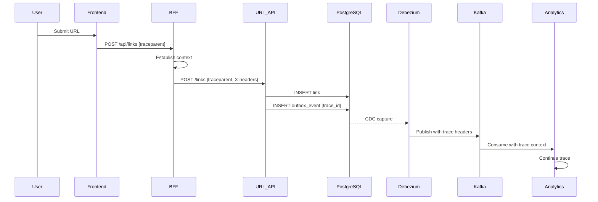

# Architecture Documentation

## Table of Contents
1. [System Overview](#system-overview)
2. [Service Architecture](#service-architecture)
3. [Trace Propagation Design](#trace-propagation-design)
4. [Data Flow Patterns](#data-flow-patterns)
5. [Technology Decisions](#technology-decisions)
6. [Security & Authentication](#security--authentication)
7. [Scalability Considerations](#scalability-considerations)

## System Overview

The OpenTelemetry URL Shortener Demo is a microservices-based application designed to demonstrate distributed tracing across various architectural patterns and boundaries.

### Core Design Principles

1. **Trace-First Architecture**: Every component is designed with observability as a primary concern
2. **Polyglot Services**: Mix of Node.js and Java to demonstrate cross-language trace propagation
3. **Mixed Paradigms**: Both synchronous (REST) and asynchronous (CDC/Kafka) communication
4. **Production Patterns**: Implements real-world patterns like transactional outbox and edge caching

## Service Architecture

### Layer 1: Edge Services

#### NGINX (Port 80)
- **Purpose**: Edge routing, rate limiting, SSL termination
- **Trace Features**: Preserves W3C trace context headers
- **Configuration**: Custom nginx.conf with trace header preservation

#### Frontend (Port 3000)
- **Technology**: Next.js 14 with App Router
- **Trace Initiation**: Generates initial trace with OpenTelemetry Web SDK
- **Key Files**: 
  - `instrumentation.ts`: OpenTelemetry setup
  - `app/page.tsx`: Main UI component

### Layer 2: API Gateway

#### BFF - Backend for Frontend (Port 3001)
- **Technology**: Node.js with Express
- **Responsibilities**:
  - Authentication orchestration (placeholder)
  - Context establishment
  - Request routing
  - Redis caching
- **Trace Features**:
  - Establishes MDC-like context
  - Propagates business headers (X-User-ID, X-Tenant-ID)
  - Simplified middleware spans for demo clarity
- **Key Components**:
  - `middleware/context.js`: Context establishment
  - `redis-client.js`: Caching layer
  - `otel-instrumentation.js`: Trace configuration

### Layer 3: Business Services

#### URL API (Port 8080)
- **Technology**: Spring Boot 3.5.3 with Spring MVC (Servlet-based)
- **Database**: PostgreSQL via JDBC/HikariCP
- **Responsibilities**:
  - Link creation and management
  - Transactional outbox pattern
  - Scheduled jobs (expiration, analytics)
- **Trace Features**:
  - Auto-instrumentation via Spring Boot starter
  - MDC integration for structured logging
  - Trace context saved to outbox for async propagation
- **Key Components**:
  - `ScheduledJobs.java`: Background tasks with tracing
  - `MdcContextFilter.java`: MDC population from headers
  - Outbox integration for CDC

#### Redirect Service (Port 8081)
- **Technology**: Spring Boot 3.5.3 with Spring WebFlux (Reactive)
- **Database**: PostgreSQL via R2DBC (non-blocking)
- **Responsibilities**:
  - High-performance URL resolution
  - Redirect handling
- **Trace Features**:
  - Reactive trace propagation
  - WebFilter-based MDC context
- **Note**: Kafka publishing for clicks is TODO

#### Analytics API (Port 8082)
- **Technology**: Spring Boot 3.5.3
- **Responsibilities**:
  - Kafka event consumption
  - Analytics processing
- **Trace Features**:
  - Extracts trace context from Kafka headers
  - Continues traces from CDC events
  - Marks async boundaries

### Layer 4: Infrastructure Services

#### PostgreSQL (Port 5432)
- **Version**: 16-alpine
- **Features**:
  - Logical replication enabled for CDC
  - Outbox table with trace context columns
- **Tables**:
  - `links`: URL mappings
  - `outbox_events`: Transactional outbox with trace context
  - `clicks`: Click analytics (placeholder)

#### Kafka (Port 9092)
- **Version**: Confluent 7.3.0
- **Topics**:
  - `link-events`: Link creation events from CDC
  - `analytics-events`: Scheduled analytics reports
  - `url-clicks`: Click events (planned)

#### Debezium/Kafka Connect (Port 8083)
- **Version**: 2.5
- **Configuration**:
  - PostgreSQL source connector
  - Outbox Event Router SMT
  - Trace context header mapping

#### Redis (Port 6379)
- **Version**: 7-alpine
- **Usage**:
  - Context caching with TTL
  - Session storage (placeholder)

#### OpenTelemetry Collector (Port 4317/4318)
- **Receivers**: OTLP (gRPC and HTTP)
- **Exporters**: Jaeger
- **Features**: Batch processing, retry logic

#### Jaeger (Port 16686)
- **Purpose**: Trace storage and visualization
- **UI Features**: Service dependency graph, trace timeline

## Trace Propagation Design

### Synchronous Propagation (HTTP)

```
Frontend → BFF → URL API
    ↓       ↓       ↓
[traceparent header propagation]
```

1. Frontend generates initial trace
2. Each service extracts and continues trace
3. Auto-instrumentation handles span creation

### Asynchronous Propagation (CDC/Kafka)

```
URL API → Outbox Table → Debezium → Kafka → Analytics API
    ↓          ↓            ↓         ↓           ↓
[trace_id, parent_span_id saved and propagated as headers]
```

1. URL API saves trace context to outbox
2. Debezium captures and maps to Kafka headers
3. Analytics API reconstructs traceparent
4. Trace continues with async boundary marker

### Context Headers

| Header | Purpose | Generator |
|--------|---------|-----------|
| `traceparent` | W3C trace context | OpenTelemetry |
| `tracestate` | Vendor-specific trace data | OpenTelemetry |
| `X-User-ID` | User identity | BFF |
| `X-Tenant-ID` | Tenant context | BFF |
| `X-Correlation-ID` | Additional correlation | BFF |
| `X-Service-Name` | Service identification | Each service |
| `X-Transaction-Name` | Business transaction type | BFF |

## Data Flow Patterns

### Pattern 1: Link Creation Flow



### Pattern 2: Transactional Outbox

The outbox pattern ensures:
1. **Atomicity**: Event and business data in same transaction
2. **Reliability**: No lost events
3. **Trace Continuity**: Context preserved through async boundary

```sql
-- Single transaction
BEGIN;
  INSERT INTO links (...) VALUES (...);
  INSERT INTO outbox_events (
    aggregate_id, event_type, payload,
    trace_id, parent_span_id, trace_flags
  ) VALUES (...);
COMMIT;
```

## Technology Decisions

### Why Mixed Technologies?

1. **Node.js BFF**: 
   - Natural fit for API gateway pattern
   - Easy integration with frontend
   - Demonstrates JS/Java trace interop

2. **Spring MVC for URL API**:
   - Traditional request/response pattern
   - Easier transaction management
   - Mature JDBC ecosystem

3. **Spring WebFlux for Redirect**:
   - High concurrency requirements
   - Non-blocking I/O benefits
   - Demonstrates reactive tracing

### Why Transactional Outbox?

1. **Reliability**: Guarantees event delivery
2. **Consistency**: Events match database state
3. **Trace Preservation**: Natural place to store context

### Why Debezium CDC?

1. **Zero application changes**: Database-level capture
2. **Performance**: Low latency, minimal overhead
3. **Trace mapping**: Configurable header extraction

## Security & Authentication

### Current State (Demo/Placeholder)

- **User Auth**: Mock JWT validation in BFF
- **Service Auth**: Placeholder M2M tokens
- **Authorization**: Mock scope checking

### Production Considerations

Would require:
1. Real Keycloak integration
2. JWT validation with public keys
3. Token refresh logic
4. Proper RBAC/scope enforcement

## Scalability Considerations

### Horizontal Scaling Points

1. **Stateless Services**: All application services can scale horizontally
2. **Kafka Partitioning**: Events can be partitioned by tenant/user
3. **Database Sharding**: Could shard by short_code prefix
4. **Cache Distribution**: Redis cluster for distributed caching

### Performance Optimizations

1. **Connection Pooling**: HikariCP for JDBC, R2DBC pool for reactive
2. **Batch Processing**: Kafka consumer batch settings
3. **Async Processing**: WebFlux for high-concurrency endpoints
4. **Caching Strategy**: Redis for hot data

### Monitoring & Alerting

1. **Trace Sampling**: Configure sampling rate for production
2. **Metric Collection**: Prometheus metrics (prepared but not enabled)
3. **Log Aggregation**: Centralized logging with trace correlation
4. **Health Checks**: All services expose health endpoints

## Future Enhancements

### Planned Features
1. Implement click tracking in redirect service
2. Real OAuth 2.0/OIDC with Keycloak
3. Prometheus metrics export
4. Circuit breaker patterns
5. Rate limiting with Redis

### Architecture Evolution
1. Service mesh consideration (Istio/Linkerd)
2. Event sourcing for audit trail
3. CQRS for read/write separation
4. GraphQL federation for API gateway