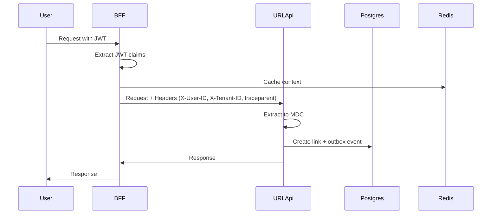
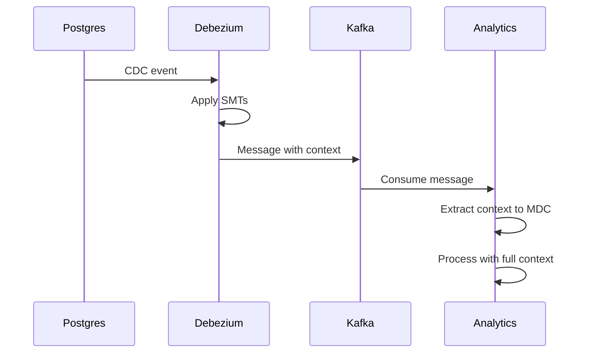
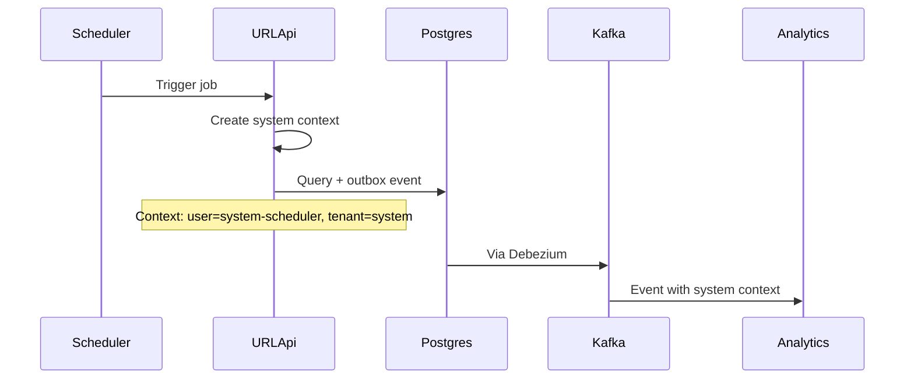

# Context Propagation Solution Documentation

## Overview
This document describes the complete end-to-end context propagation implementation for the OpenTelemetry URL Shortener Demo, including both trace context (W3C traceparent) and standard business context (user ID, tenant ID, etc.) across synchronous HTTP and asynchronous Kafka boundaries.

## Architecture Components

### 1. Context Types

#### Trace Context (W3C Standard)
- **Format**: `traceparent: 00-{traceId}-{spanId}-{flags}`
- **Purpose**: Distributed tracing correlation
- **Propagation**: Through HTTP headers and Kafka message headers

#### Standard Business Context
- **Fields**:
  - `request_id`: Unique request identifier
  - `user_id`: Authenticated user identifier
  - `tenant_id`: Multi-tenancy identifier
  - `service_name`: Origin service name
  - `transaction_type`: Business transaction type
- **Purpose**: Business correlation and logging
- **Propagation**: Through HTTP headers (X-*) and Kafka message envelope

### 2. Service Components

#### BFF (Backend for Frontend)
**Location**: `bff/middleware/context.js`
- Establishes context from JWT claims
- Caches context in Redis
- Adds standard headers to downstream requests
- Propagates W3C trace context

#### URL API (Spring Boot)
**Location**: `url-api/src/main/java/com/example/urlapi/`
- `MdcContextFilter.java`: Extracts headers to MDC
- `OutboxEventService.java`: Persists context to outbox table
- `ScheduledJobs.java`: Creates context for scheduled tasks

#### Analytics API (Spring Boot)
**Location**: `analytics-api/src/main/java/com/example/analyticsapi/`
- `KafkaListeners.java`: Extracts context from Kafka messages
- `MdcContextFilter.java`: HTTP context extraction

#### Redirect Service (Spring WebFlux)
**Location**: `redirect-service/src/main/java/com/example/redirectservice/`
- `MdcContextWebFilter.java`: Reactive context handling

### 3. Infrastructure Components

#### PostgreSQL Outbox Table
**Schema**: `scripts/002-create-outbox-table.sql`
```sql
CREATE TABLE outbox_events (
    id UUID PRIMARY KEY,
    aggregate_id VARCHAR(255),
    aggregate_type VARCHAR(255),
    event_type VARCHAR(255),
    payload JSONB,
    trace_id VARCHAR(32),
    parent_span_id VARCHAR(16),
    trace_flags VARCHAR(2),
    context JSONB,
    tenant_id VARCHAR(255),
    created_by VARCHAR(255),
    created_at TIMESTAMP
);
```

#### Debezium CDC Connector
**Configuration**: Multiple registration scripts in `debezium/`
- `register-connector-with-context.sh`: Full context with custom SMTs
- `register-connector-context-simple.sh`: Context in message envelope
- `register-connector-final.sh`: Direct header placement

#### Custom Kafka Connect SMTs
**Location**: `debezium/custom-smt/src/main/java/com/example/connect/transforms/`
- `TraceContextHeaderTransform.java`: Creates W3C traceparent header
- `StandardContextHeaderTransform.java`: Creates X-* headers from JSON

## Implementation Flow

### 1. Synchronous Flow (HTTP Request)



### 2. Asynchronous Flow (Kafka Events)



### 3. Scheduled Jobs Flow



## Context Extraction Implementation

### 1. BFF Context Middleware
```javascript
// bff/middleware/context.js
async function contextMiddleware(req, res, next) {
    const token = req.headers.authorization?.split(' ')[1];
    
    // Extract claims (mock for demo)
    const claims = {
        sub: 'user-123',
        email: 'user@example.com',
        tenant_id: 'tenant-456',
        groups: ['user', 'admin']
    };
    
    // Set context headers
    req.context = {
        userId: claims.sub,
        tenantId: claims.tenant_id,
        userEmail: claims.email,
        userGroups: claims.groups,
        requestId: req.id,
        serviceName: 'bff',
        transactionName: req.path
    };
    
    next();
}
```

### 2. Java MDC Filter
```java
// url-api/src/main/java/com/example/urlapi/MdcContextFilter.java
@Component
public class MdcContextFilter implements Filter {
    @Override
    public void doFilter(ServletRequest request, ServletResponse response, 
                        FilterChain chain) throws IOException, ServletException {
        HttpServletRequest httpRequest = (HttpServletRequest) request;
        
        try {
            // Extract headers to MDC
            MDC.put("userId", httpRequest.getHeader("X-User-ID"));
            MDC.put("tenantId", httpRequest.getHeader("X-Tenant-ID"));
            MDC.put("requestId", httpRequest.getHeader("X-Request-ID"));
            MDC.put("service", "url-api");
            
            // Extract trace context
            String traceparent = httpRequest.getHeader("traceparent");
            if (traceparent != null) {
                String[] parts = traceparent.split("-");
                if (parts.length >= 3) {
                    MDC.put("traceId", parts[1]);
                }
            }
            
            chain.doFilter(request, response);
        } finally {
            MDC.clear();
        }
    }
}
```

### 3. Kafka Context Extraction
```java
// analytics-api/src/main/java/com/example/analyticsapi/KafkaListeners.java
private void extractStandardContext(String message) {
    try {
        JsonNode root = objectMapper.readTree(message);
        
        // Extract context from message envelope
        if (root.has("context")) {
            String contextJson = root.get("context").asText();
            Map<String, Object> contextMap = objectMapper.readValue(contextJson, Map.class);
            
            // Populate MDC
            if (contextMap.containsKey("user_id")) {
                MDC.put("userId", String.valueOf(contextMap.get("user_id")));
            }
            if (contextMap.containsKey("tenant_id")) {
                MDC.put("tenantId", String.valueOf(contextMap.get("tenant_id")));
            }
            // ... other fields
        }
    } catch (Exception e) {
        logger.debug("Failed to extract context: {}", e.getMessage());
    }
}
```

## Configuration Files

### 1. Docker Compose Service Configuration
```yaml
# docker-compose.yml
kafka-connect:
  image: debezium/connect:2.5
  volumes:
    - ./debezium/custom-smt/target:/kafka/connect/custom-smt
  environment:
    CONNECT_PLUGIN_PATH: /kafka/connect
```

### 2. Logback Configuration
```xml
<!-- url-api/src/main/resources/logback.xml -->
<configuration>
    <appender name="FILE">
        <file>/logs/shared/all-services.log</file>
        <encoder>
            <pattern>%d{ISO8601} [%thread] %-5level %logger{36} - TraceId=%X{traceId:-N/A} UserId=%X{userId:-N/A} TenantId=%X{tenantId:-N/A} Service=%X{service:-N/A} - %msg%n</pattern>
        </encoder>
    </appender>
</configuration>
```

## Testing the Implementation

### 1. Create a Link with User Context
```bash
# Create a link via BFF
curl -X POST http://localhost:3001/api/links \
  -H "Authorization: Bearer mock-token" \
  -H "Content-Type: application/json" \
  -d '{"originalUrl": "https://example.com"}'
```

### 2. Check Logs for Context
```bash
# View consolidated logs
tail -f logs/shared/all-services.log | grep "TraceId"

# Example output:
# 2025-09-10 16:45:23 [http-nio-8080-exec-1] INFO LinkController - TraceId=abc123 UserId=user-123 TenantId=tenant-456 Service=url-api - Creating link
# 2025-09-10 16:45:24 [kafka-consumer] INFO KafkaListeners - TraceId=abc123 UserId=user-123 TenantId=tenant-456 Service=analytics-api - Processing link event
```

### 3. Verify Scheduled Job Context
```bash
# Wait for scheduled job (runs every 30 seconds)
docker-compose logs -f url-api | grep "system-scheduler"

# Example output:
# url-api | 2025-09-10 16:46:00 INFO ScheduledJobs - TraceId=def456 UserId=system-scheduler TenantId=system Service=url-api - Checking expired links
```

### 4. Check Jaeger for Distributed Traces
1. Open http://localhost:16686
2. Select service: "bff" or "url-api"
3. Find traces showing full context propagation

## Troubleshooting

### Issue: Context not appearing in logs
**Solution**: Check MDC filter registration and logback pattern configuration

### Issue: Kafka messages missing context
**Solution**: Verify Debezium connector configuration and custom SMT deployment

### Issue: Trace breaks at Kafka boundary
**Solution**: Ensure traceparent header extraction in Kafka listeners

### Issue: Scheduled jobs have no context
**Solution**: Check ScheduledJobs.java creates proper system context

## Current Implementation Status

### ✅ Completed
- BFF context establishment from JWT
- HTTP header propagation (X-* headers)
- W3C trace context propagation
- MDC integration in all Java services
- Outbox pattern with context persistence
- Kafka context propagation via message envelope
- Scheduled job context creation
- Centralized logging with context fields

### 🔧 Custom SMTs Available (Not Currently Active)
- TraceContextHeaderTransform: Creates traceparent headers
- StandardContextHeaderTransform: Creates X-* headers from JSON
- Note: Current implementation uses simpler envelope-based approach

### 📝 Future Enhancements
- Enable custom SMTs for header-based propagation
- Add integration tests for context verification
- Implement real JWT validation
- Add metrics for context propagation success rate
- Consider OpenTelemetry Baggage for additional context

## Summary

The context propagation solution successfully maintains both trace and business context across:
1. **Synchronous boundaries**: HTTP requests between services
2. **Asynchronous boundaries**: Kafka events via CDC
3. **Scheduled tasks**: System-initiated operations
4. **Reactive streams**: WebFlux non-blocking operations

This enables complete observability and correlation of all operations in the distributed system, whether user-initiated or system-initiated.